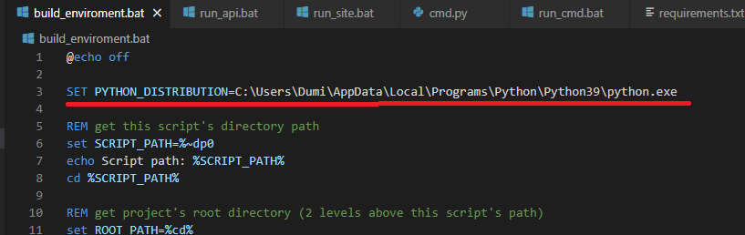

Steps for running this project:	
1.Edit the path to the python distribution from the build_enviroment.bat file.

2.Run build_enviroroment.bat for the virtual enviroment to install all the needeed libraries.

3.Execute run_api.bat for the API to start running.

4.Execute run_site.bat for the web page to make calls to the API and to display the information.

5.Execute run_cmd.bat to activate the venv, and after that you can run the cmd.py like this:
    -cmd.py all (to display all the data)
    -cmd.py skill (to display the skills)
    -cmd.py languages (to display the languages)
    -cmd.py personal (to display the personal information)
    -cmd.py experience (to display the experience)
    -cmd.py projects (to display all the projects)
    -cmd.py hobbies (to display all the hobbies)
